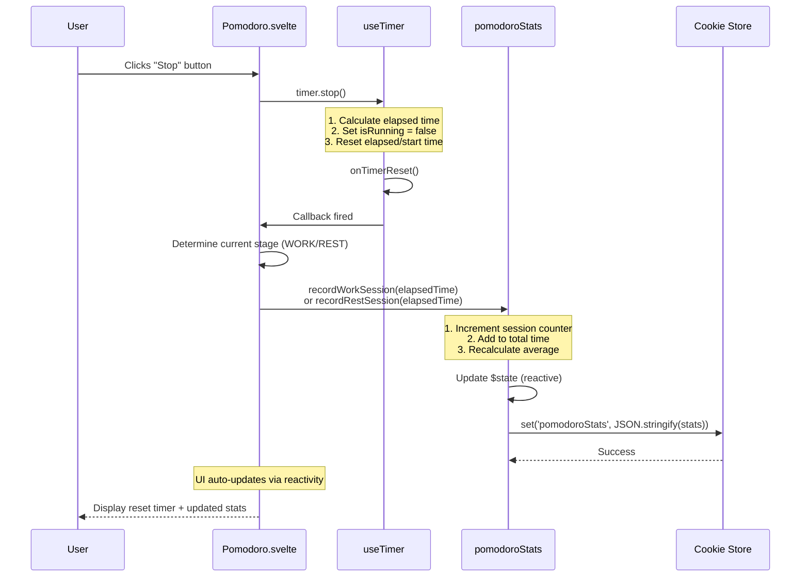
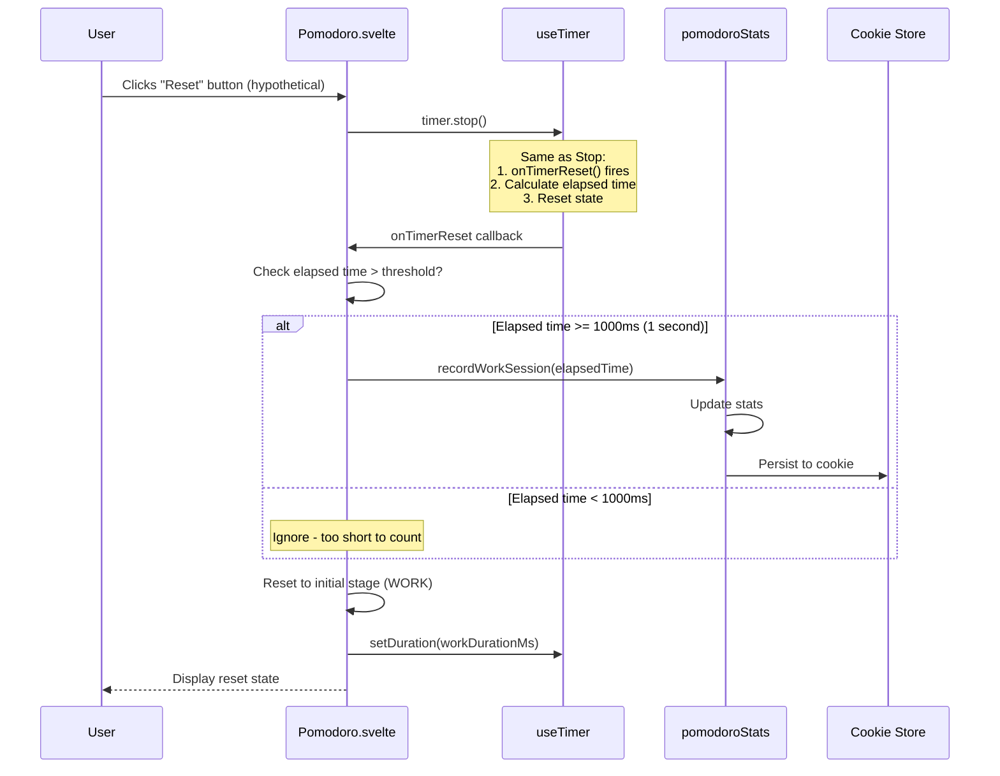
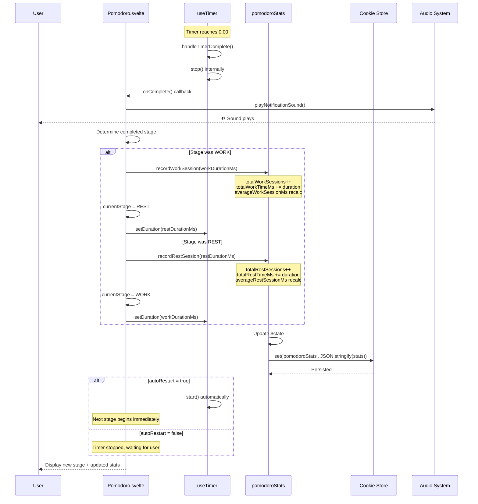
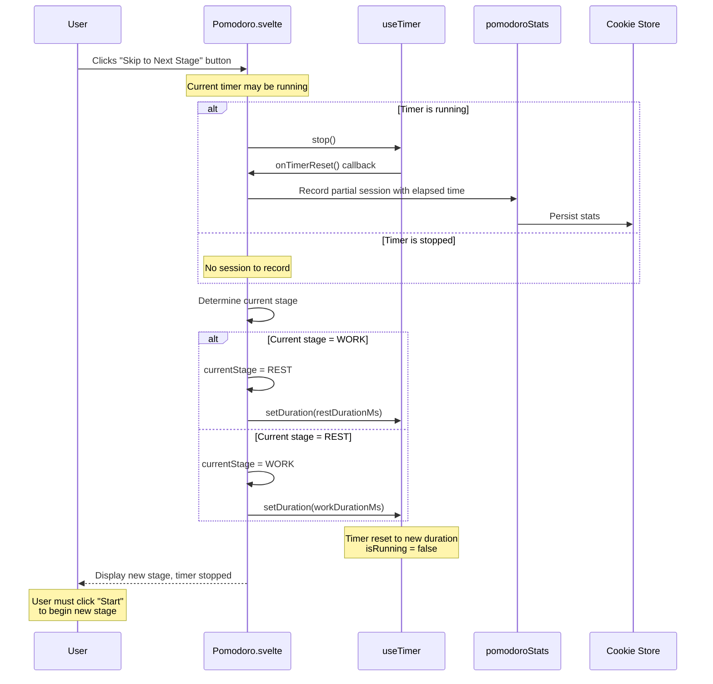

# Pomodoro Statistics - Global Store Implementation (Approach 4)

**Version:** 1.0  
**Date:** January 26, 2026  
**Status:** Design Document

---

## Table of Contents

1. [Architecture Overview](#architecture-overview)
2. [Component Structure](#component-structure)
3. [Data Flow](#data-flow)
4. [Sequence Diagrams](#sequence-diagrams)
5. [API Specification](#api-specification)
6. [Implementation Details](#implementation-details)
7. [Testing Strategy](#testing-strategy)
8. [Edge Cases & Error Handling](#edge-cases--error-handling)

---

## Architecture Overview

### Design Principles

- **Single Source of Truth**: Global store manages all statistics state
- **Reactive State**: Svelte 5 runes (`$state`) for automatic UI updates
- **Persistent Storage**: Browser cookies for cross-session persistence
- **Separation of Concerns**: Statistics logic decoupled from timer/UI logic

### High-Level Architecture

```
┌─────────────────────────────────────────────────────────┐
│                    Browser Layer                         │
│  ┌──────────────┐  ┌──────────────┐  ┌──────────────┐  │
│  │ /demo/       │  │ /apps/       │  │ /stats/      │  │
│  │ pomodoro     │  │ pomodoro     │  │ +page.svelte │  │
│  │ +page.svelte │  │ +page.svelte │  │              │  │
│  └──────┬───────┘  └──────┬───────┘  └──────┬───────┘  │
│         │                  │                  │          │
│         └──────────────────┼──────────────────┘          │
│                            │                             │
│                    ┌───────▼────────┐                    │
│                    │  Pomodoro.     │                    │
│                    │  svelte        │                    │
│                    └───────┬────────┘                    │
│                            │                             │
│         ┌──────────────────┼──────────────────┐          │
│         │                  │                  │          │
│  ┌──────▼────────┐  ┌──────▼────────┐  ┌─────▼──────┐  │
│  │ useTimer      │  │ pomodoroStats │  │ StatsDisplay│  │
│  │ .svelte.ts    │  │ Store (Global)│  │ .svelte     │  │
│  └───────────────┘  └──────┬────────┘  └─────────────┘  │
│                            │                             │
│                    ┌───────▼────────┐                    │
│                    │  Cookie Store  │                    │
│                    │  API           │                    │
│                    └────────────────┘                    │
└─────────────────────────────────────────────────────────┘
```

---

## Component Structure

### File Organization

```
src/
├── lib/
│   ├── components/
│   │   └── PomodoroDemo/
│   │       ├── Pomodoro.svelte              # UI Component
│   │       ├── useTimer.svelte.ts           # Timer Hook
│   │       └── StatsDisplay.svelte          # Stats UI (new)
│   ├── stores/
│   │   └── pomodoroStats.svelte.ts          # Global Store (new)
│   └── utils/
│       └── cookies.ts                        # Cookie utilities (new)
└── routes/
    ├── demo/pomodoro/+page.svelte
    ├── apps/pomodoro/+page.svelte
    └── stats/+page.svelte                    # Stats page (new)
```

---

## Data Flow

### State Management Flow

```
┌─────────────────────────────────────────────────────────────┐
│                   User Interaction                          │
└───────────────────────┬─────────────────────────────────────┘
                        │
                        ▼
┌─────────────────────────────────────────────────────────────┐
│              Pomodoro.svelte (UI Layer)                     │
│  • Renders timer display                                    │
│  • Handles button clicks                                    │
│  • Triggers timer events                                    │
└───────────────────────┬─────────────────────────────────────┘
                        │
                        ▼
┌─────────────────────────────────────────────────────────────┐
│           useTimer.svelte.ts (Timer Logic)                  │
│  • Manages countdown/countup                                │
│  • Fires callbacks: onComplete, onTimerReset                │
│  • Provides elapsed time                                    │
└───────────────────────┬─────────────────────────────────────┘
                        │
                        ▼
┌─────────────────────────────────────────────────────────────┐
│        pomodoroStats.svelte.ts (Global Store)               │
│  • Receives session data                                    │
│  • Updates in-memory state ($state)                         │
│  • Calculates aggregates (averages, totals)                 │
│  • Triggers persistence                                     │
└───────────────────────┬─────────────────────────────────────┘
                        │
                        ▼
┌─────────────────────────────────────────────────────────────┐
│           Cookie Store API (Persistence)                    │
│  • Serializes stats to JSON                                 │
│  • Stores in browser cookies                                │
│  • Expires in 365 days                                      │
└─────────────────────────────────────────────────────────────┘
```

### Reactive Updates

```
┌─────────────────────────────────────────────────────────────┐
│  pomodoroStats.stats.totalWorkSessions = 5                  │
│  (Global store state mutation)                              │
└───────────────────────┬─────────────────────────────────────┘
                        │
                        │ Svelte Reactivity ($state)
                        │
            ┌───────────┴───────────┐
            │                       │
            ▼                       ▼
┌───────────────────────┐ ┌─────────────────────┐
│  Pomodoro.svelte      │ │  /stats/+page.svelte│
│  (reads stats)        │ │  (reads stats)      │
│  Auto re-renders ✓    │ │  Auto re-renders ✓  │
└───────────────────────┘ └─────────────────────┘
```

---

## Sequence Diagrams

### 1. Timer Stopped (Manual Stop)



**Key Points:**
- `timer.stop()` triggers `onTimerReset` callback
- Elapsed time captured before reset
- Stats updated based on current stage (WORK vs REST)
- Cookie persisted immediately
- UI updates automatically via Svelte reactivity

---

### 2. Timer Reset (Explicit Reset - if implemented)



**Key Points:**
- Reset behavior same as Stop
- Optional threshold check to avoid recording accidental clicks
- Timer resets to initial work duration
- Stage resets to WORK

---

### 3. Timer Completes a Stage



**Key Points:**
- `onComplete()` callback fires when timer reaches zero
- Full duration recorded (not elapsed time)
- Stage switches automatically (WORK ↔ REST)
- Sound notification plays
- Auto-restart behavior depends on checkbox
- Stats saved to cookie immediately

---

### 4. User Manually Goes to Next Stage



**Key Points:**
- Manual skip always stops timer
- Records partial session if timer was running
- Does NOT auto-start next stage (requires manual start)
- Stage toggles (WORK ↔ REST)
- Duration updates to new stage's duration

---

## API Specification

### Global Store API

```typescript
// src/lib/stores/pomodoroStats.svelte.ts

interface PomodoroStats {
  totalWorkSessions: number;
  totalRestSessions: number;
  totalWorkTimeMs: number;
  totalRestTimeMs: number;
  averageWorkSessionMs: number;
  averageRestSessionMs: number;
}

class PomodoroStatsStore {
  // Reactive state
  private _stats: PomodoroStats;
  
  // Getters
  get stats(): Readonly<PomodoroStats>;
  
  // Session recording
  recordWorkSession(durationMs: number): void;
  recordRestSession(durationMs: number): void;
  
  // Persistence
  loadFromCookies(): Promise<void>;
  private persist(): void;
  
  // Testing utilities
  reset(): void;
  __TEST_ONLY_getState(): PomodoroStats;
}

export const pomodoroStats: PomodoroStatsStore;
```

### Timer Callback API

```typescript
// Modified useTimer signature
export const useTimer = (
  initialDurationMs: number,
  speedCoefficient: number,
  onComplete?: () => void,
  onTimerReset?: () => void,  // NEW: Fires when stop() called
  direction?: string
) => { /* ... */ };
```

### Integration in Pomodoro.svelte

```typescript
// Timer initialization with callbacks
let timer = useTimer(
  currentDuration,
  1,
  handleComplete,      // Fires when timer reaches 0
  handleTimerReset     // Fires when stop() called
);

// Callback implementations
const handleComplete = () => {
  playNotificationSound();
  
  // Record completed session (full duration)
  if (currentStage === Stages.WORK) {
    pomodoroStats.recordWorkSession(workDurationMs);
  } else {
    pomodoroStats.recordRestSession(restDurationMs);
  }
  
  // Switch stage
  currentStage = currentStage === Stages.WORK ? Stages.REST : Stages.WORK;
  timer.setDuration(/* new duration */);
};

const handleTimerReset = () => {
  const elapsed = timer.getCurrentElapsedTime();
  
  // Only record if timer ran for meaningful duration
  if (elapsed > 1000) { // > 1 second
    if (currentStage === Stages.WORK) {
      pomodoroStats.recordWorkSession(elapsed);
    } else {
      pomodoroStats.recordRestSession(elapsed);
    }
  }
};
```

---

## Implementation Details

### 1. Global Store Implementation

```typescript
// src/lib/stores/pomodoroStats.svelte.ts
interface PomodoroStats {
  totalWorkSessions: number;
  totalRestSessions: number;
  totalWorkTimeMs: number;
  totalRestTimeMs: number;
  averageWorkSessionMs: number;
  averageRestSessionMs: number;
}

const INITIAL_STATS: PomodoroStats = {
  totalWorkSessions: 0,
  totalRestSessions: 0,
  totalWorkTimeMs: 0,
  totalRestTimeMs: 0,
  averageWorkSessionMs: 0,
  averageRestSessionMs: 0,
};

class PomodoroStatsStore {
  private _stats = $state<PomodoroStats>({ ...INITIAL_STATS });

  get stats(): Readonly<PomodoroStats> {
    return this._stats;
  }

  recordWorkSession(durationMs: number): void {
    this._stats.totalWorkSessions += 1;
    this._stats.totalWorkTimeMs += durationMs;
    this._stats.averageWorkSessionMs = Math.floor(
      this._stats.totalWorkTimeMs / this._stats.totalWorkSessions
    );
    this.persist();
  }

  recordRestSession(durationMs: number): void {
    this._stats.totalRestSessions += 1;
    this._stats.totalRestTimeMs += durationMs;
    this._stats.averageRestSessionMs = Math.floor(
      this._stats.totalRestTimeMs / this._stats.totalRestSessions
    );
    this.persist();
  }

  async loadFromCookies(): Promise<void> {
    try {
      const cookie = await cookieStore.get('pomodoroStats');
      if (cookie?.value) {
        const saved = JSON.parse(cookie.value);
        Object.assign(this._stats, saved);
      }
    } catch (error) {
      console.error('Failed to load stats from cookies:', error);
    }
  }

  private persist(): void {
    try {
      cookieStore.set({
        name: 'pomodoroStats',
        value: JSON.stringify(this._stats),
        expires: Date.now() + 365 * 24 * 60 * 60 * 1000, // 1 year
        path: '/',
      });
    } catch (error) {
      console.error('Failed to persist stats to cookies:', error);
    }
  }

  reset(): void {
    this._stats = { ...INITIAL_STATS };
    this.persist();
  }

  // Testing utility
  __TEST_ONLY_getState(): PomodoroStats {
    if (import.meta.env.MODE !== 'test') {
      throw new Error('This method is only available in test mode');
    }
    return this._stats;
  }
}

export const pomodoroStats = new PomodoroStatsStore();
```

### 2. Modified useTimer Implementation

```typescript
// src/lib/components/PomodoroDemo/useTimer.svelte.ts
export const useTimer = (
  initialDurationMs: number = 60,
  speedCoefficient: number = 1,
  onComplete: () => void = () => {},
  onTimerReset: () => void = () => {},  // NEW callback
  direction: string = TimerDirection.DECREASING
) => {
  // ... existing state ...

  const stop = () => {
    // Fire callback BEFORE resetting state
    onTimerReset();
    
    isRunning = false;
    elapsedTime = 0;
    startTime = 0;
    resetInterval();
  };

  const getCurrentElapsedTime = (): number => {
    if (direction === TimerDirection.INCREASING) {
      return currentDuration - elapsedTime;
    } else {
      return elapsedTime;
    }
  };

  return {
    // ... existing exports ...
    getCurrentElapsedTime,
    set onTimerReset(callback: () => void) { onTimerReset = callback; },
  };
};
```

### 3. Updated Pomodoro.svelte

```svelte
<script lang="ts">
  import { onMount } from 'svelte';
  import { pomodoroStats } from '$lib/stores/pomodoroStats.svelte';
  import { playNotificationSound } from './notificationSound';
  import { useTimer } from './useTimer.svelte';

  const Stages = {
    WORK: 'WORK',
    REST: 'REST'
  } as const;

  let { workDurationMs = 25 * 1000, restDurationMs = 5 * 1000 } = $props();
  let currentStage = $state<keyof typeof Stages>(Stages.WORK);
  let currentDuration = $derived(
    currentStage === Stages.WORK ? workDurationMs : restDurationMs
  );

  let timer = useTimer(currentDuration, 1);

  // Set callbacks
  timer.onComplete = () => {
    playNotificationSound();

    // Record completed session
    if (currentStage === Stages.WORK) {
      pomodoroStats.recordWorkSession(workDurationMs);
      currentStage = Stages.REST;
    } else {
      pomodoroStats.recordRestSession(restDurationMs);
      currentStage = Stages.WORK;
    }

    timer.setDuration(currentDuration);
  };

  timer.onTimerReset = () => {
    const elapsed = timer.getCurrentElapsedTime();

    // Only record if timer ran for > 1 second
    if (elapsed > 1000) {
      if (currentStage === Stages.WORK) {
        pomodoroStats.recordWorkSession(elapsed);
      } else {
        pomodoroStats.recordRestSession(elapsed);
      }
    }
  };

  // Manual stage skip
  const skipToNextStage = () => {
    // Stop will trigger onTimerReset if running
    timer.stop();

    // Toggle stage
    currentStage = currentStage === Stages.WORK ? Stages.REST : Stages.WORK;
    timer.setDuration(currentDuration);
  };

  onMount(async () => {
    await pomodoroStats.loadFromCookies();
  });
</script>

<div class="timer-container">
  <p data-testid="time-display">{timer.formattedTime}</p>
  <p class="stage">{currentStage} Session</p>

  <div class="controls">
    <input 
      type="checkbox" 
      data-testid="auto-start-checkbox" 
      bind:checked={timer.autoRestart} 
    />
    <label>Auto-start next stage</label>
  </div>

  <div class="buttons">
    <button 
      data-testid="start-pause-btn" 
      onclick={timer.isRunning ? timer.pause : timer.start}
    >
      {timer.isRunning ? 'Pause' : 'Start'}
    </button>
    <button data-testid="stop-btn" onclick={timer.stop}>Stop</button>
    <button data-testid="skip-btn" onclick={skipToNextStage}>Skip Stage</button>
  </div>

  <!-- Display stats inline -->
  <div class="stats">
    <h3>Statistics</h3>
    <p>Work Sessions: {pomodoroStats.stats.totalWorkSessions}</p>
    <p>Rest Sessions: {pomodoroStats.stats.totalRestSessions}</p>
    <p>Avg Work: {Math.floor(pomodoroStats.stats.averageWorkSessionMs / 1000)}s</p>
  </div>
</div>
```

### 4. Dedicated Stats Page

```svelte
<!-- src/routes/stats/+page.svelte -->
<script lang="ts">
  import { onMount } from 'svelte';
  import { pomodoroStats } from '$lib/stores/pomodoroStats.svelte';

  onMount(async () => {
    await pomodoroStats.loadFromCookies();
  });

  const formatTime = (ms: number) => {
    const minutes = Math.floor(ms / 1000 / 60);
    const seconds = Math.floor((ms / 1000) % 60);
    return `${minutes}m ${seconds}s`;
  };

  const resetStats = () => {
    if (confirm('Are you sure you want to reset all statistics?')) {
      pomodoroStats.reset();
    }
  };
</script>

<div class="stats-page">
  <h1>Pomodoro Statistics</h1>

  <section class="stats-grid">
    <div class="stat-card">
      <h2>Work Sessions</h2>
      <p class="big-number">{pomodoroStats.stats.totalWorkSessions}</p>
      <p class="detail">
        Total Time: {formatTime(pomodoroStats.stats.totalWorkTimeMs)}
      </p>
      <p class="detail">
        Average: {formatTime(pomodoroStats.stats.averageWorkSessionMs)}
      </p>
    </div>

    <div class="stat-card">
      <h2>Rest Sessions</h2>
      <p class="big-number">{pomodoroStats.stats.totalRestSessions}</p>
      <p class="detail">
        Total Time: {formatTime(pomodoroStats.stats.totalRestTimeMs)}
      </p>
      <p class="detail">
        Average: {formatTime(pomodoroStats.stats.averageRestSessionMs)}
      </p>
    </div>
  </section>

  <button class="danger" onclick={resetStats}>Reset All Statistics</button>
</div>

<style>
  .stats-page {
    max-width: 800px;
    margin: 0 auto;
    padding: 2rem;
  }

  .stats-grid {
    display: grid;
    grid-template-columns: repeat(auto-fit, minmax(250px, 1fr));
    gap: 2rem;
    margin: 2rem 0;
  }

  .stat-card {
    background: #f5f5f5;
    padding: 2rem;
    border-radius: 8px;
  }

  .big-number {
    font-size: 3rem;
    font-weight: bold;
    margin: 1rem 0;
  }

  .detail {
    color: #666;
    margin: 0.5rem 0;
  }

  .danger {
    background: #dc3545;
    color: white;
    border: none;
    padding: 0.75rem 1.5rem;
    border-radius: 4px;
    cursor: pointer;
  }
</style>
```

---

## Testing Strategy

### Unit Tests: Global Store

```typescript
// src/lib/stores/pomodoroStats.svelte.spec.ts
import { describe, it, expect, beforeEach, afterEach, vi } from 'vitest';
import { pomodoroStats } from './pomodoroStats.svelte';

describe('PomodoroStatsStore', () => {
  beforeEach(() => {
    pomodoroStats.reset();
  });

  afterEach(() => {
    pomodoroStats.reset();
  });

  it('initializes with zero stats', () => {
    expect(pomodoroStats.stats.totalWorkSessions).toBe(0);
    expect(pomodoroStats.stats.totalRestSessions).toBe(0);
  });

  it('records work session and calculates average', () => {
    pomodoroStats.recordWorkSession(25000);
    pomodoroStats.recordWorkSession(30000);

    expect(pomodoroStats.stats.totalWorkSessions).toBe(2);
    expect(pomodoroStats.stats.totalWorkTimeMs).toBe(55000);
    expect(pomodoroStats.stats.averageWorkSessionMs).toBe(27500);
  });

  it('persists to cookies when recording session', () => {
    const setSpy = vi.spyOn(cookieStore, 'set');

    pomodoroStats.recordWorkSession(25000);

    expect(setSpy).toHaveBeenCalledWith({
      name: 'pomodoroStats',
      value: expect.stringContaining('"totalWorkSessions":1'),
      expires: expect.any(Number),
      path: '/',
    });
  });

  it('loads stats from cookies', async () => {
    vi.spyOn(cookieStore, 'get').mockResolvedValue({
      name: 'pomodoroStats',
      value: JSON.stringify({
        totalWorkSessions: 5,
        totalWorkTimeMs: 125000,
        averageWorkSessionMs: 25000,
        totalRestSessions: 0,
        totalRestTimeMs: 0,
        averageRestSessionMs: 0,
      }),
    });

    await pomodoroStats.loadFromCookies();

    expect(pomodoroStats.stats.totalWorkSessions).toBe(5);
  });
});
```

### Integration Tests: Component Behavior

```typescript
// src/lib/components/PomodoroDemo/Pomodoro.svelte.spec.ts
import { describe, it, expect, vi, beforeEach, afterEach } from 'vitest';
import { mount } from 'svelte';
import { pomodoroStats } from '$lib/stores/pomodoroStats.svelte';
import Pomodoro from './Pomodoro.svelte';

describe('Pomodoro with Global Store', () => {
  let target: HTMLElement;

  beforeEach(() => {
    vi.useFakeTimers();
    target = document.createElement('div');
    document.body.appendChild(target);
    pomodoroStats.reset();
  });

  afterEach(() => {
    vi.restoreAllMocks();
    document.body.removeChild(target);
    pomodoroStats.reset();
  });

  it('records work session when timer completes', async () => {
    mount(Pomodoro, { target, props: { workDurationMs: 2000 } });

    const startBtn = target.querySelector('[data-testid="start-pause-btn"]')!;
    startBtn.click();

    vi.advanceTimersByTime(2000);

    await vi.waitFor(() => {
      expect(pomodoroStats.stats.totalWorkSessions).toBe(1);
      expect(pomodoroStats.stats.totalWorkTimeMs).toBe(2000);
    });
  });

  it('records partial session when stopped mid-way', async () => {
    mount(Pomodoro, { target, props: { workDurationMs: 10000 } });

    const startBtn = target.querySelector('[data-testid="start-pause-btn"]')!;
    const stopBtn = target.querySelector('[data-testid="stop-btn"]')!;

    startBtn.click();
    vi.advanceTimersByTime(5000);
    stopBtn.click();

    await vi.waitFor(() => {
      expect(pomodoroStats.stats.totalWorkSessions).toBe(1);
      expect(pomodoroStats.stats.totalWorkTimeMs).toBeGreaterThanOrEqual(4000);
      expect(pomodoroStats.stats.totalWorkTimeMs).toBeLessThanOrEqual(6000);
    });
  });

  it('skips to next stage and records partial session', async () => {
    mount(Pomodoro, { target, props: { workDurationMs: 10000, restDurationMs: 5000 } });

    const startBtn = target.querySelector('[data-testid="start-pause-btn"]')!;
    const skipBtn = target.querySelector('[data-testid="skip-btn"]')!;

    startBtn.click();
    vi.advanceTimersByTime(3000);
    skipBtn.click();

    await vi.waitFor(() => {
      expect(pomodoroStats.stats.totalWorkSessions).toBe(1);
      expect(target.textContent).toContain('REST');
      expect(target.textContent).toContain('00:05');
    });
  });
});
```

---

## Edge Cases & Error Handling

### Edge Case Matrix

| Scenario | Expected Behavior | Implementation |
|----------|------------------|----------------|
| **Timer stopped at 0 elapsed** | Don't record session (< 1s threshold) | Check `elapsed > 1000` |
| **Cookie Store API unavailable** | Log error, continue without persistence | Try-catch in `persist()` |
| **Corrupted cookie data** | Reset to initial stats, log warning | Try-catch in `loadFromCookies()` |
| **Multiple tabs open** | Each tab reads stale data until reload | Document limitation or implement BroadcastChannel |
| **Timer speedCoefficient > 1** | Record actual elapsed time (not wall time) | Use `timer.getCurrentElapsedTime()` |
| **User changes duration mid-session** | Record partial at old duration | Handled by `onTimerReset` |
| **Negative average (division by zero)** | Initialize to 0 | Use `Math.floor()` which handles this |
| **Cookie size exceeds 4KB** | Very unlikely with current stats schema | Monitor in production |

### Error Handling Implementation

```typescript
// Robust cookie loading
async loadFromCookies(): Promise<void> {
  try {
    const cookie = await cookieStore.get('pomodoroStats');
    if (!cookie?.value) return;

    const saved = JSON.parse(cookie.value);

    // Validate shape
    if (typeof saved !== 'object' || saved === null) {
      throw new Error('Invalid stats format');
    }

    // Merge with defaults to handle missing fields
    Object.assign(this._stats, INITIAL_STATS, saved);
  } catch (error) {
    console.error('Failed to load stats, resetting:', error);
    this.reset();
  }
}

// Graceful persistence failure
private persist(): void {
  try {
    const serialized = JSON.stringify(this._stats);
    
    // Check size (cookies max ~4KB)
    if (serialized.length > 4000) {
      console.warn('Stats cookie approaching size limit');
    }

    cookieStore.set({
      name: 'pomodoroStats',
      value: serialized,
      expires: Date.now() + 365 * 24 * 60 * 60 * 1000,
      path: '/',
    });
  } catch (error) {
    console.error('Failed to persist stats:', error);
    // Don't throw - app continues without persistence
  }
}
```

---

## Migration Path

### Phase 1: Implement Store (Week 1)
1. Create `pomodoroStats.svelte.ts`
2. Add unit tests
3. Create utility functions for cookies

### Phase 2: Integrate with Timer (Week 1-2)
1. Modify `useTimer` to add `onTimerReset` callback
2. Update `Pomodoro.svelte` to use store
3. Add integration tests

### Phase 3: Stats Page (Week 2)
1. Create `/stats/+page.svelte`
2. Add styling and formatting
3. E2E tests

### Phase 4: Polish (Week 3)
1. Error handling refinements
2. Performance monitoring
3. Documentation

---

## Performance Considerations

- **Cookie writes**: Only on session completion (not every tick)
- **Reactivity overhead**: Minimal - only 6 state properties
- **JSON serialization**: < 200 bytes, negligible
- **Cross-tab sync**: Not implemented (requires BroadcastChannel)

---

## Security Considerations

- Cookies set with `path: '/'` (accessible site-wide)
- No `HttpOnly` flag (needs JavaScript access)
- No `Secure` flag (consider adding in production)
- Data is client-side only (no server validation)
- Stats can be manipulated via DevTools (acceptable for local stats)

---

## Future Enhancements

1. **Export/Import Stats**: Allow users to backup as JSON
2. **Charts/Graphs**: Visualize trends over time
3. **Daily/Weekly Resets**: Configurable stat periods
4. **Goals/Targets**: Set session goals with progress tracking
5. **Multi-Device Sync**: Use server storage instead of cookies
6. **Break Reminders**: Notifications based on session count

---

**End of Document**
