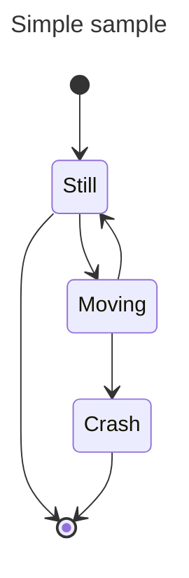
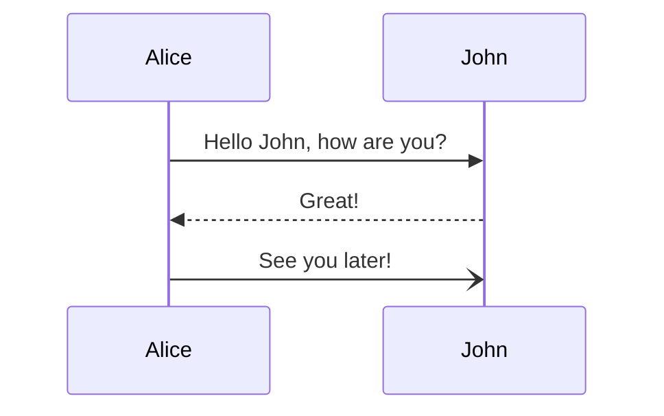

# Statistics

## Requirements

1. Have a page outlining stats for user:
   1. Total weekly session count
   2. Total weekly work duration (ms)
   3. Total weekly rest duration (ms)
   4. Total daily work duration (ms)
   5. Total daily rest duration (ms)
   6. Averages for all above
   7. Duration averages and session count per weekday
2. Persist elapsed time when user stops timer or changes page view
3. Have graphs to visualize all data

## Steps

1. Create page to display statistics
2. Readd stats store and display stats in new page
3. Modify stats store to include new data points
4. Create store to track current elapsed times
5. Create hook to tie current elapsed times with stats
6. Write unittests for new components and pages
7. Modify style of everything

## Notes

- The stats store could be used to track the current elapsed time
  - Or there could be a separate store to track the current elapsed times
- To persist current elapsed time I might need to call something inside `onUnmount`
- Increasing the session count should only be triggered when the rest segment of the session is completed, not on reset

### Work Duration Recording

- The work duration is currently being recorded by retrieving the current elapsed time through a function exposed by the timer hook
- If the user interrupts the timer in any way: resetting segment, going to next stage, navigating to config or stat page

#### Recording duration when user resets timer

1. User starts timer with work duration
2. User clicks on the reset timer button
3. `timer.onReset` callback is triggered, executing function to record work duration using the current elapsed time and passing this value to the stat store function responsible for recording duration (`recordWorkSession`)

#### Recording duration when user goes to next stage

1. User starts timer with work duration
2. User clicks on the button to go to the next stage
3. `Pomodoro.goToNextStage` is triggered, executing function to record work duration using the current elapsed time and passing this value to the stat store function responsible for recording duration (`recordWorkSession`)

#### Recording duration when user navigates to another page

1. User starts timer with work duration
2. User navigates to configuration or statistics page
3. `onUnmount` is triggered, executing function to record work duration using the current elapsed time and passing this value to the stat store function responsible for recording duration (`recordWorkSession`)

#### Diagrams

